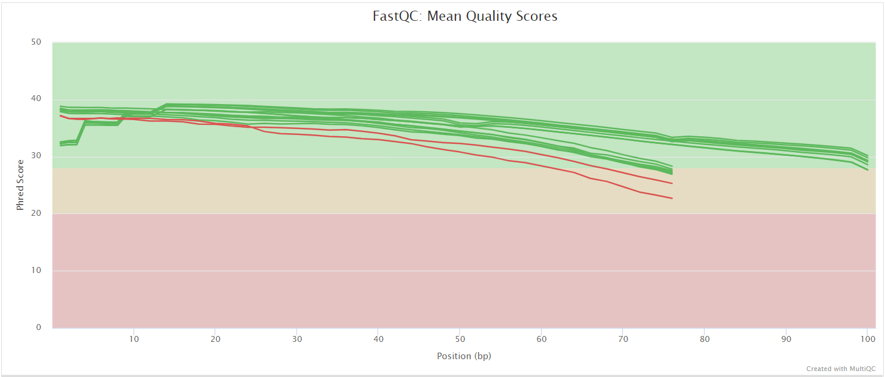

# jianhong/shotgun: Output

## Introduction

This document describes the output produced by the pipeline. Most of the plots are taken from the MultiQC report, which summarises results at the end of the pipeline.

The directories listed below will be created in the results directory after the pipeline has finished. All paths are relative to the top-level results directory.

## Pipeline overview

The pipeline is built using [Nextflow](https://www.nextflow.io/) and processes data using the following steps:

* [FastQC](#fastqc) - Raw read QC
* [KneadData](#kneaddata) - Clean reads
* [Metaphlan](#metaphlan) - Metaphlan outputs
* [Kraken2](#kraken2) - Kraken2 outputs
* [Kaiju](#kaiju) - Kaiju outputs
* [HUMAnN3](#humann3) - HUMAnN3 outputs
* [mOTUs2](#motus2) - mOTUs2 outputs
* [Centrifuge](#centrifuge) - Centrifuge outputs
* [MultiQC](#multiqc) - Aggregate report describing results and QC from the whole pipeline
* [Pipeline information](#pipeline-information) - Report metrics generated during the workflow execution

### FastQC

Output files

* `fastqc/`
    * `*_fastqc.html`: FastQC report containing quality metrics.
    * `*_fastqc.zip`: Zip archive containing the FastQC report, tab-delimited data file and plot images.

[FastQC](http://www.bioinformatics.babraham.ac.uk/projects/fastqc/) gives general quality metrics about your sequenced reads. It provides information about the quality score distribution across your reads, per base sequence content (%A/T/G/C), adapter contamination and overrepresented sequences. For further reading and documentation see the [FastQC help pages](http://www.bioinformatics.babraham.ac.uk/projects/fastqc/Help/).

> **NB:** The FastQC plots displayed in the MultiQC report shows _untrimmed_ reads. They may contain adapter sequence and potentially regions with low quality.

### KneadData

Output files

* `kneaddata/`
    * `fastqsBySample/`: clean fastqs by sample.
    * `countsBySample/`: stats created by KneadData for each sample.
    * `merged/`: merged stats.

[`KneadData`](https://huttenhower.sph.harvard.edu/kneaddata/) is a tool designed to perform quality control on metagenomic sequencing data, especially data from microbiome experiments. In these experiments, samples are typically taken from a host in hopes of learning something about the microbial community on the host. However, metagenomic sequencing data from such experiments will often contain a high ratio of host to bacterial reads. This tool aims to perform principled in silico separation of bacterial reads from these “contaminant” reads, be they from the host, from shotgun sequences, or other user-defined sources.

### Metaphlan

Output files

* `metaphlan/`
    * `bySamples/`: reports by sample.
    * `merged/`: merged reports.

[`Metaphlan`](https://huttenhower.sph.harvard.edu/metaphlan/) (Metagenomic Phylogenetic Analysis) is a computational tool for profiling the composition of microbial communities from metagenomic shotgun sequencing data. MetaPhlAn relies on unique clade-specific marker genes identified from ~17,000 reference genomes (~13,500 bacterial and archaeal, ~3,500 viral, and ~110 eukaryotic)

### Kaiju

Output files

* `kaiju/`
    * `bySamples/`: reports by sample.
    * `merged/`: merged reports.
    * `krona/`: Krona html reports.

[`Kaiju`](https://github.com/bioinformatics-centre/kaiju) is a program for the taxonomic classification of high-throughput sequencing reads, e.g., Illumina or Roche/454, from whole-genome sequencing of metagenomic DNA. Reads are directly assigned to taxa using the NCBI taxonomy and a reference database of protein sequences from microbial and viral genomes.

### Kraken2

Output files

* `kraken2/`
    * `bySamples/`: reports by sample.
    * `merged/`: merged reports.
    * `krona/`: Krona html reports.

[`Kraken2`](https://ccb.jhu.edu/software/kraken2/) is a taxonomic classification system using exact k-mer matches to achieve high accuracy and fast classification speeds. This classifier matches each k-mer within a query sequence to the lowest common ancestor (LCA) of all genomes containing the given k-mer. The k-mer assignments inform the classification algorithm.

### HUMAnN3

Output files

* `humann/`
    * `bySamples/`: reports by sample.
    * `regroup`: regouped results by sample.
    * `normalized`: normalized results by sample.
    * `join/`: merged reports.

[`HUMAnN 3.0`](https://huttenhower.sph.harvard.edu/humann/) is the next iteration of HUMAnN, the HMP Unified Metabolic Analysis Network. HUMAnN is a method for efficiently and accurately profiling the abundance of microbial metabolic pathways and other molecular functions from metagenomic or metatranscriptomic sequencing data.

### mOTUs2

Output files

* `motus/`
    * `bySamples/`: reports by sample.
    * `merged/`: merged reports.
    * `krona/`: Krona html reports.

[`mOTUs`](https://github.com/motu-tool/mOTUs) profiler is a computational tool that estimates relative taxonomic abundance of known and currently unknown microbial community members using metagenomic shotgun sequencing data.

### Centrifuge

Output files

* `centrifuge/`
    * `bySamples/`: reports by sample.
    * `merged/`: merged reports.
    * `krona/`: Krona html reports.

[`centrifuge`](https://ccb.jhu.edu/software/centrifuge/manual.shtml) is a novel microbial classification engine that enables rapid, accurate, and sensitive labeling of reads and quantification of species on desktop computers. The system uses a novel indexing scheme based on the Burrows-Wheeler transform (BWT) and the Ferragina-Manzini (FM) index, optimized specifically for the metagenomic classification problem. Centrifuge requires a relatively small index (5.8 GB for all complete bacterial and viral genomes plus the human genome) and classifies sequences at a very high speed, allowing it to process the millions of reads from a typical high-throughput DNA sequencing run within a few minutes. Together these advances enable timely and accurate analysis of large metagenomics data sets on conventional desktop computers.

### MultiQC

Output files

* `multiqc/`
    * `multiqc_report.html`: a standalone HTML file that can be viewed in your web browser.
    * `multiqc_data/`: directory containing parsed statistics from the different tools used in the pipeline.
    * `multiqc_plots/`: directory containing static images from the report in various formats.

[MultiQC](http://multiqc.info) is a visualization tool that generates a single HTML report summarising all samples in your project. Most of the pipeline QC results are visualised in the report and further statistics are available in the report data directory.

Results generated by MultiQC collate pipeline QC from supported tools e.g. FastQC. The pipeline has special steps which also allow the software versions to be reported in the MultiQC output for future traceability. For more information about how to use MultiQC reports, see <http://multiqc.info>.

### Pipeline information

Output files

* `pipeline_info/`
    * Reports generated by Nextflow: `execution_report.html`, `execution_timeline.html`, `execution_trace.txt` and `pipeline_dag.dot`/`pipeline_dag.svg`.
    * Reports generated by the pipeline: `pipeline_report.html`, `pipeline_report.txt` and `software_versions.yml`. The `pipeline_report*` files will only be present if the `--email` / `--email_on_fail` parameter's are used when running the pipeline.
    * Reformatted samplesheet files used as input to the pipeline: `samplesheet.valid.csv`.

[Nextflow](https://www.nextflow.io/docs/latest/tracing.html) provides excellent functionality for generating various reports relevant to the running and execution of the pipeline. This will allow you to troubleshoot errors with the running of the pipeline, and also provide you with other information such as launch commands, run times and resource usage.
